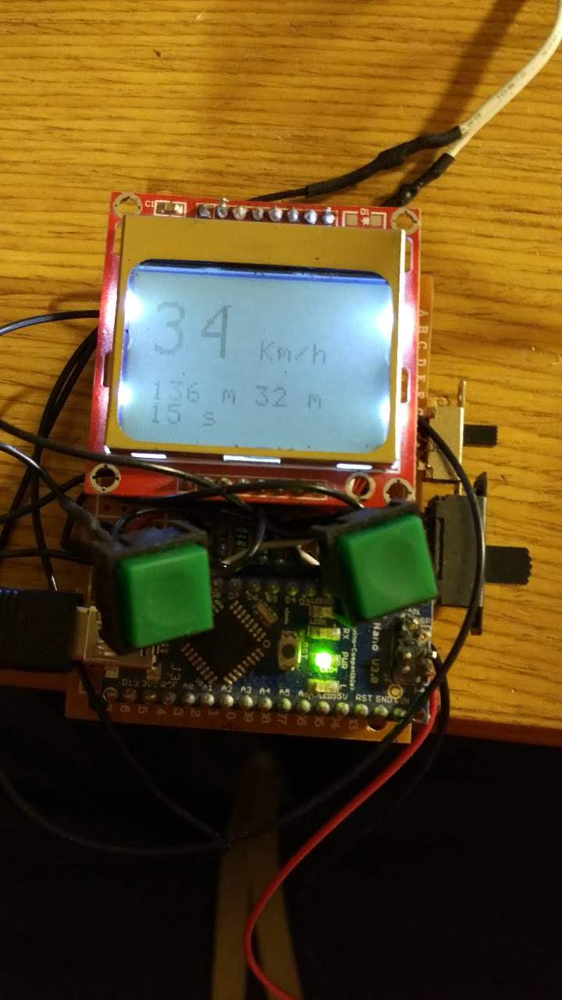
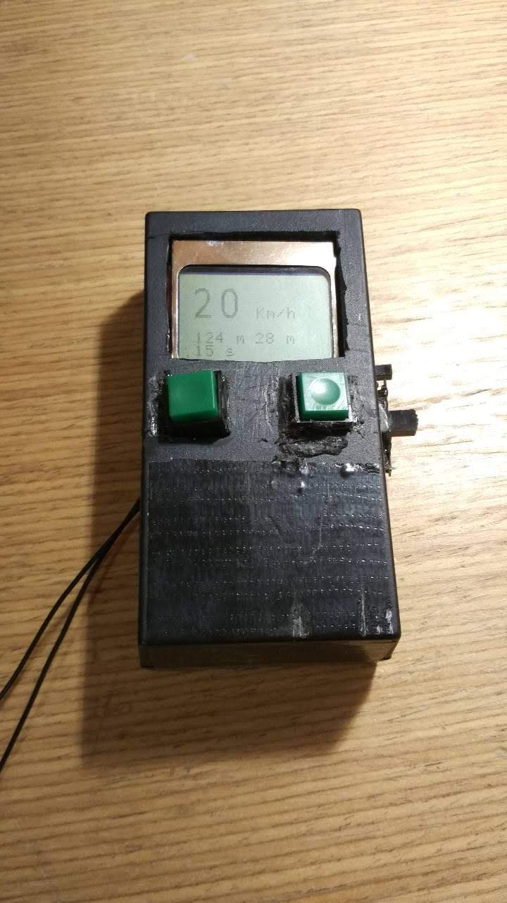

# Tachometer

This is my old grammar school project. The goal was to build a fully-fuctioning speedometer for bikes.

Hardware used
- Arduino Nano
- Nokia3310 display
- 2 buttons, 2 switches
- 5V voltage regulator for regulating voltage of the 9V battery

My thesis can be downloaded here (only in Czech): 

Since I have always been very dexterous, I packed the speedometer into a plastic box and glued it all together. Having done that I found out that there was some bad connection on the PCB, so I had to open it again and fix it. Looks terrible, I know. And it is not usable, after you hit a first pothole, the speedometer would fall apart.

Apart from that, the software and hardware works well and that was the goal :)

Hardware without a case    |  A tiny, durable and good looking speedometer 🙃
:-------------------------:|:-------------------------:
  |  
